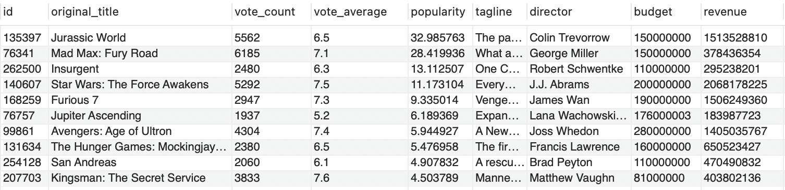
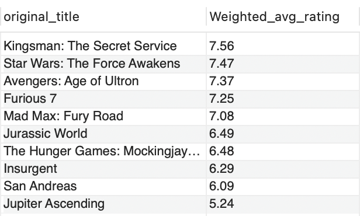

Q1. Weighted avg rating
SQL
Solved
feature icon
Using hints is now penalty free
Use Hint
Problem Statement:

Calculate the weighted average rating from the columns vote_count and vote_average and save the column as "Weighted_avg_rating".

Write a query to display the top 10 movies and their rating up to two decimals based on the newly created column.

Return the columns original_title, Weighted_avg_rating
Return the output ordered by Weighted_avg_rating in descending order and original_title in ascending order.
Note: Use the given formula to calculate a weighted average rating:

(v/(v+m) * R) + (m/(m+v) * C )

Where,

v is the number of votes for the movie - vote_count
m is the minimum vote required, take m as 104.0
R is the average rating of the movie - vote_average
C is the mean vote across the whole report take c as 5.97

Dataset description for movies table:

id - tmdb movie id
imdb_id - imdb movie id
popularity - A numeric quantity specifying the movie popularity.
budget - The budget in which the movie was made.
revenue - The worldwide revenue generated by the movie.
original_title - The title of the movie
cast - The name of the lead and supporting actors.
homepage - A link to the homepage of the movie.
director - The name of the director of the movie
tagline - Movie's tagline.
keywords - The keywords or tags related to the movie.
overview - A brief description of the movie.
runtime - The running time of the movie in minutes.
genres - The genres of the movies
production_companies - The production house of the movie.
release_date - the date on which it was released.
vote_count - the count of votes received.
vote_average - average ratings the movie received.
release_year - the year in which it was released.
Sample Input:

Table: movies



Sample Output:



SOLUTION
# Write your MySQL query statement below

```SQL
select
original_title,
round((vote_count/(vote_count+104.0)*vote_average)+(104.0/(104.0+vote_count)*5.97),2) as 'Weighted_avg_rating'
from movies
order by Weighted_avg_rating desc, original_title asc  
limit 10;
```