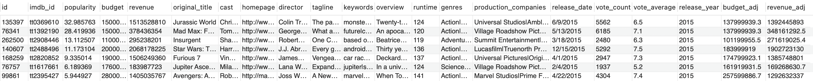

Q3. Third highest revenue
SQL
Solved
feature icon
Using hints is now penalty free
Use Hint
Problem Statement:

Write a query to find all the details of the movie that has the third-highest revenue.

Note:

Return all the columns.
No two movies have the same revenue. (i.e, all the values in the revenue column are unique).
Dataset description for movies table:

1) id - tmdb movie id

2) imdb_id - imdb movie id

3) popularity -A numeric quantity specifying the movie popularity.

4) budget -The budget in which the movie was made.

5) revenue - The worldwide revenue generated by the movie.

6) original_title- The title of the movie

7) cast - The name of the lead and supporting actors.

8) homepage - A link to the homepage of the movie.

9) director - The name of the director of the movie

10) tagline - Movie's tagline.

11) keywords -The keywords or tags related to the movie.

12) overview -A brief description of the movie.

13) runtime -The running time of the movie in minutes.

14) genres -The genres of the movies

15) production_companies-The production house of the movie.

16) release_date -the date on which it was released.

17) vote_count -the count of votes received.

18) vote_average - average ratings the movie received.

19) release_year - the year on which it was released.

Sample Input:

Table: movies

Sample Output:

Approach 1:

STEP 1: Select all the columns from the table movies.

STEP 2:Use the order by clause and order the column revenue in descending order to get the highest to lowest revenue.

STEP 3: Use the limit and offset to display the third-highest revenue movie details.
So, offset 2 skips the first two values, and limit 1 displays the third value which is the third-highest revenue.

select *
from movies
order by revenue desc
limit 1 offset 2;
Approach 2:

select *
from movies
order by revenue desc
limit 2,1;